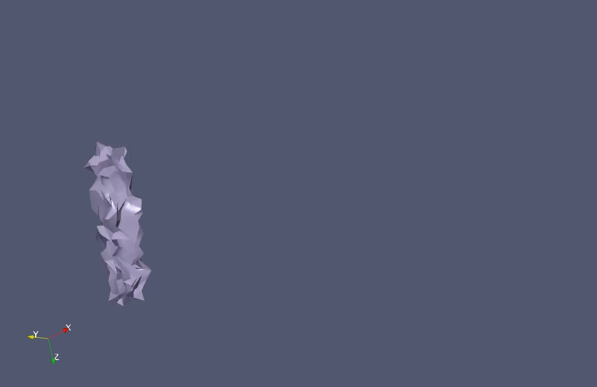

# Vertex Block Descent
My work in progress implementation of a couple scenes using logic from Chen's Vertex Block Descent paper.

My first major checkpoint in implementation was for a grad physically-based modeling course final project taught by Dr. John Keyser.

### Sources & References
- Vertex Block Descent [paper](https://doi.org/10.1145/3658179) and project [page](https://graphics.cs.utah.edu/research/projects/vbd/).
- Anka Chen's [Gaia](https://github.com/AnkaChan/Gaia) engine with VBD implemented.

### Scenes

I initialized all vertices' y component to zero, and observed the simulation starting after 90 frames.


Random initialization of vertices.


In the multiple attempts and days debugging, my implementation struggled to achieve resolution for more complex, non-uniform meshes. For example, here is one attempt:


And here is the beam just moving around following a randomization. It reminds me of a worm, lol.


### Everything Starts in `src/main.cpp`
```
src
├── constants.h
├── include
│   ├── external
│   ├── simulate
│   │   ├── Mesh.cpp
│   │   ├── Mesh.h
│   │   ├── MeshGPU.cu
│   │   ├── MeshGPU.h
│   │   ├── PhysicsScene.cpp
│   │   └── PhysicsScene.h
│   └── utils
│       ├── anim.py
│       ├── graphcolor.py
│       ├── simplifymesh.py
│       ├── tetrahedralize.py
│       ├── utils.cpp
│       ├── utils.h
│       └── visualize.py
├── include.h
└── main.cpp
```

### Building
Dependencies used are
- CMake
- C++17
- CUDA 11.8
- nlohmann-json (reading scene data json in cpp)
- meshio (reading .obj & .vtk)
- tetgen (for tetrahedralization)
- networkx (for greedy graph coloring)
- vtk
- paraview

I use vcpkg, but you can link packages however works for you - while in the project source directory, you can either run `./rebuild.ps1` or across environments that just runs
`cmake -B build/ -DCMAKE_BUILD_TYPE=Release -DCMAKE_TOOLCHAIN_FILE="C:/Dev/vcpkg/scripts/buildsystems/vcpkg.cmake"`

Then, `cmake --build build/ --config Release --parallel`

### Adding New Models
Start by loading the venv with 

```
python -m venv ./env
.\env\Scripts\activate # (on bash-like shells use source ./env/bin/activate on bash)
pip install -r requirements.txt
```

The full pipeline starts by adding a `.obj` into `resources/models`, where you can then

1. (OPTIONAL) Simplify mesh, reducing vertice count with `python simplify.py <desired_obj> <percent> [resource_dir]` which outputs `models/obj/<desired_objname>_simplified.obj`
2. Tetrahedralize any obj with `python tetrahedralize.py <desired_obj> [resource_dir]`.
3. Graph color the tetrahedralized `.vtk` produced in 2 with `python graphcolor.py <desired_vtk> [resource_dir]`, creating `models/vtk/<desired_vtkname>_c.vtk`.
4. From here you can add scenes to `scene.json`, and change main.cpp based on the desired scene number. This is not fully tested.

### A Note About Eigen
Because I had about 24 hours to do it, I wanted to make a naive implementation with CUDA - one that simply used the nvcc compiled Eigen code, as in recent years Eigen has made that possible. Unfortunately for me, this did not play out well and ate up a lot of time debugging. That is on me!

Running the same code once on GPU and CPU, after a few timesteps we can see divergence for what I believe to be numerical error. View if you would like:

<details>
<summary>Expand for GPU/CPU output</summary>

GPU:
```
[INITIALIZATION COMPLETE!]
[STARTING SIMULATION]
Starting write to ./output/frame_1.vtu
Finishing write to ./output/frame_1.vtu
f_ij: 192172256.000000, 346224288.000000, 520737504.000000
H_ij:
380175648.000000, 675869376.000000, 1014492288.000000
675869376.000000, 1229186304.000000, 1835191168.000000
1014492288.000000, 1835191168.000000, 2761210624.000000
dE_dxi: -192172256.000000, -346224288.000000, -520737504.000000
d2E_dxi_dxi:
379175648.000000, 675869376.000000, 1014492288.000000
675869376.000000, 1228186368.000000, 1835191168.000000
1014492288.000000, 1835191168.000000, 2760210688.000000
m1 = -1.666667, m2 = 0.000000, m3 = 0.000000, k = 59.163815
A = 0.052941, a = 1.200000

f_ij: 188528576.000000, 329807776.000000, 537309312.000000
H_ij:
390478144.000000, 694438976.000000, 997900800.000000
694438976.000000, 1302355584.000000, 1774486528.000000
997900800.000000, 1774486528.000000, 2820675840.000000
dE_dxi: 3643679.750000, 16416512.000000, -16571811.000000
d2E_dxi_dxi:
10302486.000000, 18569580.000000, -16591499.000000
18569572.000000, 73169272.000000, -60704640.000000
-16591513.000000, -60704664.000000, 59465340.000000
m1 = 0.000000, m2 = 1.152889, m3 = -1.133332, k = 7.935088
A = 0.079412, a = 1.200000

...

f_ij: 382094400.000000, 292159968.000000, 730809856.000000
H_ij:
820257152.000000, 597809344.000000, 1404617216.000000
597809472.000000, 1348982400.000000, 1700318720.000000
1404617216.000000, 1700318720.000000, 3236186624.000000
dE_dxi: -188274272.000000, 32554662.000000, -192308480.000000
d2E_dxi_dxi:
398422304.000000, -67841776.000000, 401548000.000000
-67841648.000000, 15270087.000000, -68999480.000000
401548032.000000, -68999448.000000, 412014080.000000
m1 = -0.424649, m2 = 1.242017, m3 = 0.288761, k = 28.773058
A = 0.103892, a = 1.200000
```

CPU:
```
[INITIALIZATION COMPLETE!]
[STARTING SIMULATION]
Starting write to ./output/frame_1.vtu
Finishing write to ./output/frame_1.vtu
force: 192172256.000000, 346224288.000000, 520737504.000000
hessian:
380175648.000000, 675869376.000000, 1014492288.000000
675869376.000000, 1229186176.000000, 1835191168.000000
1014492288.000000, 1835191168.000000, 2761210624.000000
dE_dxi: -192172256.000000, -346224288.000000, -520737504.000000
d2E_dxi_dxi:
379175648.000000, 675869376.000000, 1014492288.000000
675869376.000000, 1228186240.000000, 1835191168.000000
1014492288.000000, 1835191168.000000, 2760210688.000000
m1 = -1.666667, m2 = 0.000000, m3 = 0.000000, k = 59.163815
A = 0.052941, a = 1.200000

force: 188528576.000000, 329807776.000000, 537309312.000000
hessian:
390478144.000000, 694438912.000000, 997900800.000000
694438912.000000, 1302355456.000000, 1774486528.000000
997900800.000000, 1774486528.000000, 2820676096.000000
dE_dxi: 3643680.000000, 16416518.000000, -16571814.000000
d2E_dxi_dxi:
10302512.000000, 18569568.000000, -16591520.000000
18569536.000000, 73169312.000000, -60704688.000000
-16591520.000000, -60704672.000000, 59465376.000000
m1 = 0.000000, m2 = 1.152889, m3 = -1.133332, k = 7.935088
A = 0.079412, a = 1.200000

...

force: 382094336.000000, 292159936.000000, 730809792.000000
hessian:
820257280.000000, 597809280.000000, 1404617344.000000
597809344.000000, 1348982144.000000, 1700318464.000000
1404617344.000000, 1700318464.000000, 3236186880.000000
dE_dxi: -188274240.000000, 32554680.000000, -192308432.000000
d2E_dxi_dxi:
398422368.000000, -67841792.000000, 401548096.000000
-67841712.000000, 15270046.000000, -68999632.000000
401548096.000000, -68999648.000000, 412014048.000000
m1 = -0.424649, m2 = 1.242017, m3 = 0.288761, k = 28.773052
A = 0.103892, a = 1.200000
```
</details>

Here is a table describing the timestep where things first diverge.
| variable | CPU | GPU |
| --- | --- | --- |
| force | 382094336.000000, 292159936.000000, 730809792.000000 | 382094400.000000, 292159968.000000, 730809856.000000 |
| hessian | 820257280.000000, 597809280.000000, 1404617344.000000 | 820257152.000000, 597809344.000000, 1404617216.000000 |
| dE_dxi | -188274240.000000, 32554680.000000, -192308432.000000 | -188274272.000000, 32554662.000000, -192308480.000000 |
| d2E_dxi_dxi | 398422368.000000, -67841792.000000, 401548096.000000 | 398422304.000000, -67841776.000000, 401548000.000000 |
| m1 | -0.424649 | -0.424649 |
| m2 | 1.242017 | 1.242017 |
| m3 | 0.288761 | 0.288761 |
| k | 28.773052 | 28.773058 |
| A | 0.103892 | 0.103892 |
| a | 1.200000 | 1.200000 |

Observe that the forces fall off here. This was enough for me to make a note about, because although it was cheap using Eigen instead of something else with stricter CUDA support, it is unfortunate to see minor errors caused by operation differences on the GPU vs CPU. At least this is my assumption, it is likely I made an error elsewhere.

### Improvement Focuses
First off I dived into this with very little understanding of the math behind it, and so that black box made things very complicated. With more time now, I want to go back to understanding theory before I can rewrite the code, as I understand the pitfalls and patterns with my current code.

- [ ] Rewrite CUDA with a library intended for GPU matrix math, like [cuBLAS](https://developer.nvidia.com/cublas)
- [ ] Work at learning more about math (i.e. hand-deriving the Hessian), so I can formulate the code that calculates it meaningfully
- [ ] Add the vertex-face and edge-edge collisions, friction, and damping force support, also figure out self-collisions.
- [ ] Rigid body representation
- [ ] Cloth simulation
- [ ] Clearer code outline that I can be proud of
- [ ] Visually appealing rendering and maybe even real-time interactions


I would say I am very elated to be able to get to this point concluding my introduction to physics for animation modeling. The idea that I can learn and digest information, write words in a funny order on a keyboard, and with the help of modern technology be able to bring such incredible things to life. These numerical outputs, when rendered show something seriously beautiful to me.
